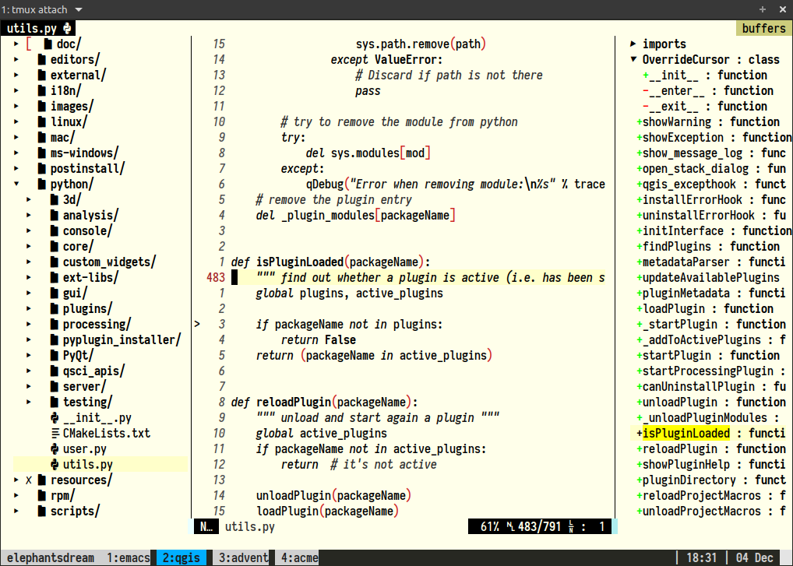

# ACME-colors for vim

ACME colors for vim. Because code counts. Supports 256 colors.

This is pretty close to the [original acme color theme](https://github.com/plan9-for-vimspace/acme-colors), however, I was annoyed about the underline in the CursorLine. Hence, I removed it here.

